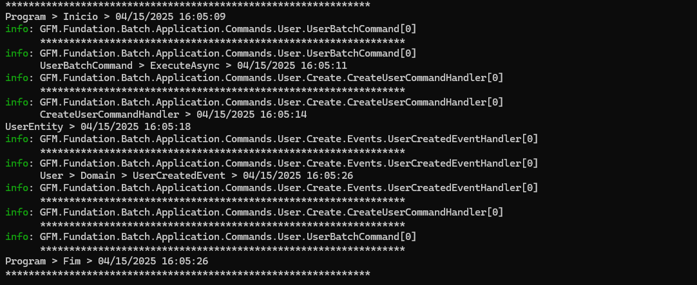

# 🧩 GFM.Mediator.netcore9

## 📖 Visão Geral

O **GFM.Mediator.netcore9** é um projeto criado com o objetivo de substituir bibliotecas pagas ou com planos comerciais futuros como **MediatR** ou **Autometer**, oferecendo uma alternativa open source leve, extensível e de fácil integração.

Este projeto foi desenvolvido em **.NET Core 9.0** e segue os princípios do **CQRS**, com suporte nativo a:

- 📤 `Send` (requisições com resposta)
- 📣 `Publish` (eventos do tipo pub/sub)
- 🧪 Behaviors (`Pipeline` para validações, exceções e extensões futuras)
- ✅ Validadores personalizados
- 🧲 Tratamento de exceções centralizado
- 📦 Injeção de dependência baseada em Assembly (como no MediatR)

---

## 🏗 Estrutura da Solução

```bash
📂 GFM.Fundation (src)
├── 📂 App
│   ├── 📂 Enuns               # Enumerações reutilizáveis (ex: EGender)
│   ├── 📂 Response            # Tipos padrão de resposta como ApiResult, BaseResponse
├── 📂 Domain
│   ├── 📂 BaseEntity.cs       # Entidades base
│   ├── 📂 AggregateRoot.cs    # Suporte a DDD
│   ├── 📂 Event.cs            # Eventos que já implementam INotification
├── 📂 SimpleMediator
│   ├── 📂 Behaviors
│   │   ├── ValidationBehavior.cs
│   │   ├── ExceptionHandlingBehavior.cs
│   │   └── ValidationException.cs
│   ├── 📂 Interface
│   │   ├── IRequest.cs, INotification.cs, IMediator.cs, etc.
│   └── Mediator.cs           # Core do seu mediator customizado
```

---

## 🧪 Projeto de Validação

```bash
📂 GFM.Fundation.Batch (App)
├── 📂 Application
│   ├── 📂 Commands
│   │   ├── 📂 User.Create
│   │   │   ├── CreateUserCommand, Handler, Validator, Response
│   │   │   └── Events (ex: UserCreatedEventHandler)
│   ├── 📂 Queries (reserva para queries separadas)
├── 📂 Domain
│   ├── 📂 User
│   │   ├── UserEntity.cs
│   │   └── Events (ex: UserCreatedEvent.cs)
├── 📂 CrossCutting
│   └── 📂 InjecaoDependencia
│       └── MediatorServiceCollectionExtension.cs
├── Program.cs (execução CLI)
```

---

## ⚙️ Tecnologias Utilizadas

- **.NET Core 9.0**
- **CQRS Pattern**
- **Pipeline Behaviors** (como MediatR)
- **Injeção de dependência via Assembly**
- **xUnit** (para testes unitários)
- **CommandLineUtils** para execução CLI

---

## 🚀 Como Executar o Projeto

### 🧪 Rodar o exemplo de teste de domínio

```bash
cd GFM.Fundation.Batch
dotnet run
```

### ✅ Rodar testes unitários

```bash
dotnet test
```

---

## ✨ Por que usar este projeto?

- ✅ **Zero dependências externas**
- 🔓 **Open Source**
- 💡 **Extensível**: suporte a logs, validações, políticas, cache, eventos
- 🔁 **Padronizado**: arquitetura moderna baseada em CQRS
- 🔍 **Fácil integração com DDD + eventos de domínio**

---

## Teste feito 




## 📫 Como contribuir

Pull requests são bem-vindos! Sinta-se à vontade para propor melhorias, ajustes ou abrir uma issue.

---

## 👨‍💻 Autor

- **Guilherme Figueiras Maurila**

[](https://www.linkedin.com/in/guilherme-maurila)  
[](mailto:gfmaurila@gmail.com)
